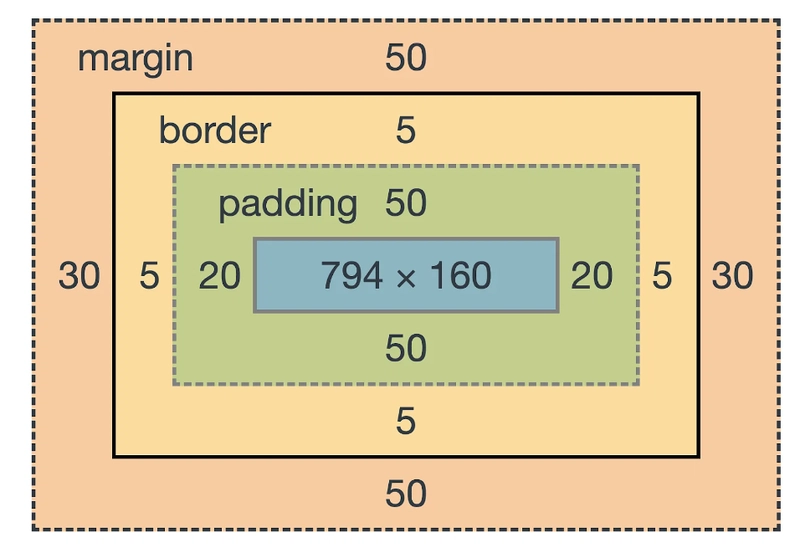
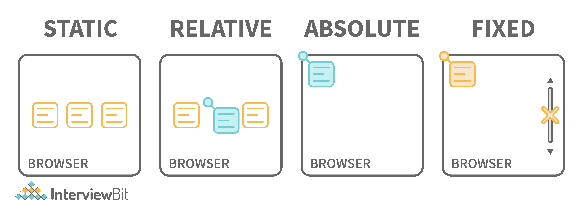
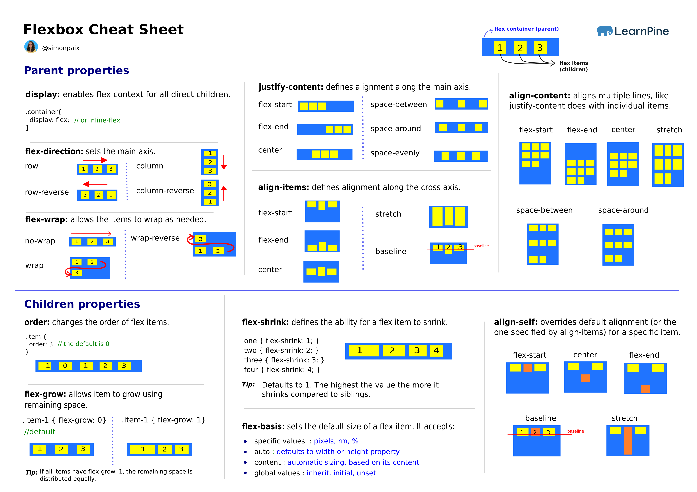
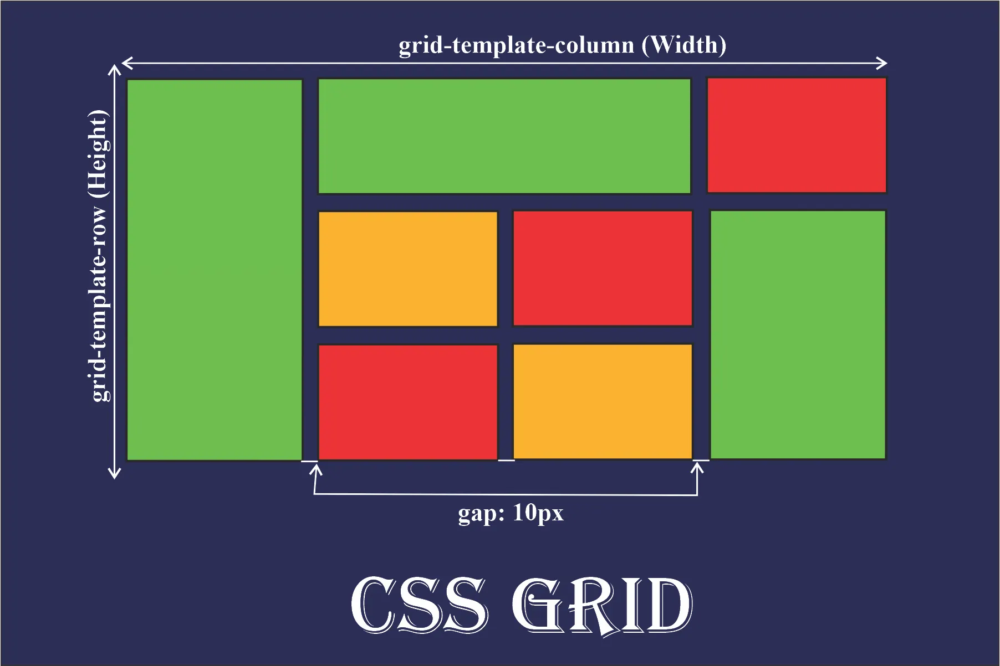

## 1. The Box Model

In CSS, every single element (like a paragraph, a header, or an image) is a rectangular box. To change the size or spacing of an element, you must understand the four layers of this box.

### The 4 Layers (From Inside to Outside)

1. **Content:** This is the actual text, image, or video inside the tag.
2. **Padding:** This is the empty space *inside* the box. It clears space around the content. It takes the background color of the element.
3. **Border:** This is the line that goes around the padding and content.
4. **Margin:** This is the empty space *outside* the box. It separates this element from other elements. It is always transparent.

### Important Concept: `box-sizing`

By default, the browser calculates width by adding the padding and border *on top* of the width you set.

* **Problem:** If you set `width: 100px` and `padding: 20px`, the total size becomes **140px**. This breaks layouts.
* **Solution:** We use `box-sizing: border-box`. This tells the browser: "If I say 100px, the total width must be 100px." The browser will shrink the content automatically to fit the padding inside.

---

## 2. Positioning

The `position` property tells the browser strictly where to place an element. It can take the element out of the normal document flow.

### The 5 Types of Position

1. **Static (Default):** The element sits where it normally belongs. The properties `top`, `left`, `right`, and `bottom` do not work here.
2. **Relative:** The element sits in its normal spot, but you can move it slightly using `top` or `left`. It leaves a blank space where it used to be.
3. **Absolute:** The element is removed from the normal flow. It looks for the nearest parent that is **not static** (usually "relative") and positions itself inside that parent. If it finds no parent, it positions itself relative to the HTML body.
4. **Fixed:** The element is stuck to the browser window (viewport). It stays in the same place even when you scroll down the page.
5. **Sticky:** A mix of relative and fixed. It acts normal until you scroll past it, then it "sticks" to the top of the screen.

---

## 3. Flexbox (Flexible Box Layout)

Flexbox is a "one-dimensional" layout system. This means it is designed to arrange items in a **single line**: either a horizontal row OR a vertical column.

### Key Terminology

* **Flex Container:** The parent element. You add `display: flex` here.
* **Flex Items:** The direct children inside the container.
* **Main Axis:** The primary direction. By default, this is a **Row** (left to right).
* **Cross Axis:** The perpendicular direction. By default, this is a **Column** (top to bottom).

### Alignment Controls

* **Justify Content:** How to distribute space along the **Main Axis** (e.g., center the items horizontally).
* **Align Items:** How to distribute space along the **Cross Axis** (e.g., center the items vertically).

---

## 4. CSS Grid

CSS Grid is a "two-dimensional" layout system. Unlike Flexbox, Grid allows you to work with **rows and columns at the same time**. It is like a virtual spreadsheet overlay on your website.

### Key Terminology

* **Grid Container:** The parent element. You add `display: grid` here.
* **Grid Template Columns:** Defines how wide the columns are.
* **Grid Template Rows:** Defines how tall the rows are.
* **Gap:** The empty space (gutters) between the rows and columns.
* **The `fr` Unit:** A special unit for Grid. It stands for "fraction." It calculates the available free space and divides it up.

### When to use Flexbox vs. Grid?

* **Use Flexbox** for small components (navigation bars, buttons inside a card, list items).
* **Use Grid** for the big picture layout (Header + Sidebar + Main Content + Footer).

---

## 5. Responsive Design & Media Queries

Responsive design means making your website look good on all screen sizes (Mobile, Tablet, Desktop).

### The Viewport Meta Tag

This is a line of code in the HTML Head. It tells mobile phones not to zoom out. It makes the website width equal to the device screen width.

### Media Queries (`@media`)

These are conditional rules in CSS. You can tell the browser: "Only apply these styles if the screen is wider than 600px."

### Mobile First Strategy

This is the modern way to code:

1. First, write CSS for **mobile phones** (the default code).
2. Next, use a Media Query to add changes for **tablets**.
3. Finally, use a Media Query to add changes for **desktop screens**.

This is easier because mobile layouts are usually simpler (everything is in one column). You add complexity only as the screen gets bigger.
