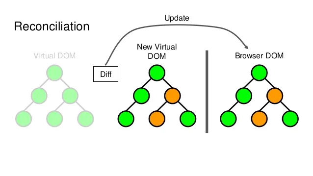
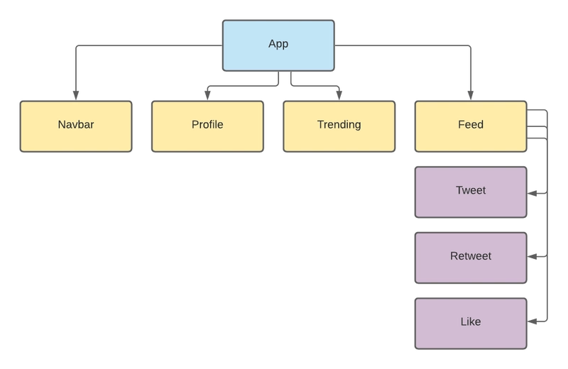
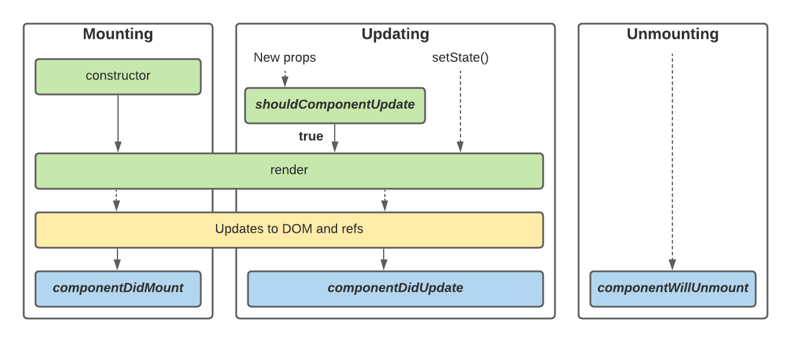

# React Seminar: The Essentials

## 1. What is React?

React is a JavaScript library developed by Facebook. Its primary goal is to manage complex User Interfaces (UI) in a **declarative** way.

* **Imperative (The Old Way):** You tell the browser step-by-step *how* to change the UI (e.g., "Find the div with ID 'app', remove the class 'active', add a new paragraph, change the text color").
* **Declarative (The React Way):** You tell the browser *what* the UI should look like based on the current data (state), and React handles the "how" automatically.

---

## 2. Why use React?

There are three main reasons React has become the industry standard:

### A. The Virtual DOM (Performance)

Updating the actual HTML (Real DOM) is slow and heavy for the browser. React solves this by using a **Virtual DOM**:

1. React keeps a lightweight copy of the UI in memory.
2. When data changes, React updates the Virtual DOM first (which is very fast).
3. It compares the new Virtual DOM to the previous one to calculate the differences (a process called "Diffing").
4. It updates the **Real DOM** with *only* the specific parts that changed.
This allows the browser to redraw only the changed elements without repainting the entire webpage.



### B. Component Architecture

You build small, reusable "Lego blocks" (components) that manage their own logic. This makes large applications easier to maintain and scale.

### C. The Ecosystem

Because React is so widely used, there is a massive community and a library for almost every need (routing, styling, testing, etc.).

---

## 3. What is a Component?

A Component is a reusable piece of code that represents how a section of the UI looks and acts. Components are arranged in a **Hierarchy (Tree)**, starting from a Root component down to its children.



There are two ways to define them:

1. **Class Components (The "Old" Way):** Defined as ES6 classes that inherit from `React.Component`. They must implement a `render()` method.
2. **Functional Components (The "Modern" Way):** Defined as standard JavaScript functions. They must be capitalized.

### How to define a component?

#### Class Based Component

```jsx
import './App.css'
import React from 'react';

// 1. Must extend React.Component
class App extends React.Component {
  constructor(props) {
    super(props);
    // 2. State is an object initialized in the constructor
    this.state = {
      count: 0
    }
  }

  // 3. Methods are often arrow functions to bind 'this' correctly
  increment = () => {
    // 4. MUST use this.setState() - never mutate this.state directly
    // Using a function (prevState) is safer for updates based on old state
    this.setState((prevState) => ({
      count: prevState.count + 1
    }));
  }

  // 5. The render() method is required and returns JSX
  render() {
    return <>
      <h2>Counter App</h2>
      <h3>Count is: {this.state.count}</h3>
      <button onClick={this.increment}>Click</button>
    </>
  }
}
export default App

```

#### Functional Components

```jsx
import './App.css'
// 1. Import the useState hook
import { useState } from 'react'

// 2. Just a standard JS function (capitalized)
export default function AppFunctional(props) {

    // 3. useState returns an array: [currentValue, setterFunction]
    // No "this", no constructor needed
    const [counter, setCounter] = useState(0);

    const increment = () => {
        // 4. Use the setter function to update state
        // React sees this change and re-runs this function to update the UI
        setCounter(prevCounter => prevCounter + 1);
    }

  // 5. Returns JSX directly (no render method)
    return (
        <>
            <h2>Counter App - Functional Way</h2>
            <h3>Count is: {counter}</h3>
            <button onClick={increment}>Click</button>
        </>
    )

}
```

## 4. What is JSX?

**JSX (JavaScript XML)** is a syntax extension that looks like HTML but allows you to write markup directly inside JavaScript.  

**The Bridge { }**: You can insert JavaScript logic (variables, functions, math) inside JSX by wrapping it in curly braces.  
**The Single Parent Rule**: JSX elements must be wrapped in one top-level parent element (or a Fragment <>...</>).  

JavaScript

```js
const name = "Alex";
// The {name} inside the h1 is Javascript logic inside HTML
const element = <h1>Hello, {name}</h1>;
```

**Without JSX (Under the Hood)**

React doesn't actually understand JSX. Build tools (like Babel) convert the JSX above into standard JavaScript using React.createElement

```jsx
const name = "Alex";
// arguments: type, props, children
const element = React.createElement(
  'h1', 
  null, 
  `Hello, ${name}`
);
```

## 5. What are Props?

**Props** (short for Properties) are how components communicate. They are used to pass data **down** the component tree.

* **Direction:** Unidirectional flow (Parent $\rightarrow$ Child).
* **Immutability:** Props are **read-only**. A child component receives props but cannot modify them.

```jsx
// 1. Parent passes "color" to Child
<Car color="red" />

// 2. Child reads "color" via props
function Car(props) {
  return <h2>I am a {props.color} car!</h2>;
}
```

## 6. What is State?

**State** is the internal data that a component uses to manage its own logic (like a counter, a toggle, or form input).

* **State vs. Props:** Props come from the *outside* (Parent), while State is managed *inside* the component.
* **Re-rendering Trigger:**
  * If **State** changes → The component re-renders.
  * If **Props** change → The component re-renders.
* **The Golden Rule:** Never change state directly (e.g., `state.count = 5`). You must use a **setter function** so React knows to trigger the update.

## 7. The Component Lifecycle

The component lifecycle describes the state through which components go from the moment of their creation until they get removed from the DOM

1. **Mounting (Creation):** The component is created and inserted into the DOM.
2. **Updating:** The component changes because of new **Props** or **State**.
3. **Unmounting (Removal):** The component is removed from the DOM.

S

### A. In Class Components (The Old Way)

Class components use specific methods for each stage. You have to declare them separately.

* `componentDidMount()`: Runs once after the component enters the DOM. Good for API calls.
* `componentDidUpdate()`: Runs every time state or props change.
* `componentWillUnmount()`: Runs just before the component is deleted. Good for cleanup (deleting timers, removing event listeners).

```jsx
class LifecycleDemo extends React.Component {
  componentDidMount() {
    console.log("1. Component is born (Mounted)");
  }

  componentDidUpdate() {
    console.log("2. Component just changed (Updated)");
  }

  componentWillUnmount() {
    console.log("3. Component is about to die (Unmounted)");
  }

  render() {
    return <h1>Hello World</h1>;
  }
}
```

### B. In Functional Components (The Modern Way)

Functional components don't have those specific methods. Instead, we use the **`useEffect`** hook for all of them.

The behavior depends on the **Dependency Array** (the second argument `[]`).

* **Mounting:** Pass an empty array `[]`.
* **Updating:** Pass variables in the array `[count]`.
* **Unmounting:** Return a function from the effect.

```jsx
import { useEffect, useState } from 'react';

function LifecycleDemo() {
  const [count, setCount] = useState(0);

  // Case 1: Mounting (Runs only ONCE)
  useEffect(() => {
    console.log("1. Component Mounted");

    // Case 3: Unmounting (The Cleanup Function)
    return () => {
      console.log("3. Component Unmounted");
    };
  }, []); // <--- Empty array means "Only on Mount"

  // Case 2: Updating (Runs whenever 'count' changes)
  useEffect(() => {
    console.log("2. Count updated to:", count);
  }, [count]); // <--- Runs when 'count' changes

  return <h1>{count}</h1>;
}
```

## 8. Setting up with Vite

**Vite** (French for "fast") is the modern standard for creating React apps. It is significantly faster than the older "Create React App" because it serves code on demand rather than bundling everything at start.

### How to create a React App

Open your terminal and run the following commands:

```bash
# 1. Create the project (follow the prompts to select 'React' and 'JavaScript')
npm create vite@latest my-react-app -- --template react

# 2. Go into the project folder
cd my-react-app

# 3. Install the dependencies
npm install

# 4. Start the development server
npm run dev
